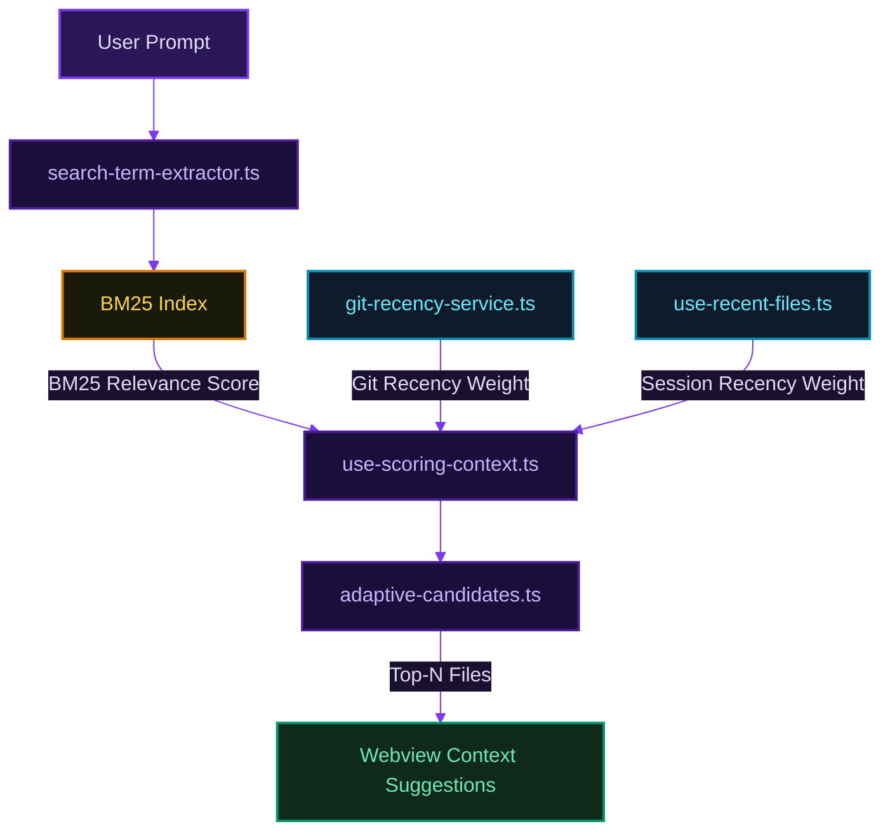

# Architecture Overview

BabaDeluxe consists of two main repositories that work together:

- **`babadeluxe-vscode`** — VS Code extension (TypeScript, Node.js context)
- **`babadeluxe-webview`** — Chat UI (Vue 3, Pinia, runs in VS Code webview or standalone browser)

This document covers how these two pieces fit together and documents the key systems within each.

---

## Extension ↔ Webview Bridge

The VS Code extension hosts the webview in a `WebviewPanel` / sidebar view. Communication happens via `postMessage` with a typed message protocol defined in `types.ts`. The webview sends requests (e.g., resolve file content, sync pinned context, auth token handshake), and the extension responds asynchronously using a `requestId`-based promise pattern.

Key files:
- `src/use-webview-common.ts` — shared message handler setup
- `src/baba-sidebar-view.ts` — sidebar panel host and webview lifecycle
- `src/webview-auth-controller.ts` — bridges the active auth session into the webview
- `src/webview-pins-controller.ts` — syncs `context-pins-store` state to the webview in real time
- `src/csp-helper.ts` — builds the Content Security Policy header for the webview iframe

---

## Context Intelligence Pipeline (Extension)

This is the core feature of BabaDeluxe and the least documented system. It automatically ranks codebase files by relevance to the user's current message.



### BM25 Index

| File | Role |
|------|------|
| `bm25-index-service.ts` | Builds and queries the BM25 index over all indexable files |
| `bm25-index-watcher.ts` | Watches the filesystem for changes and triggers incremental rebuilds |
| `bm25-rebuild-queue.ts` | Debounced queue to batch rapid file changes into single rebuilds |
| `use-bm25-runtime.ts` | Singleton accessor for the live index instance |
| `index-storage.ts` | Persists the serialized index to workspace storage |
| `indexable-file-extensions.ts` | Allowlist of file extensions that are indexed (source files only) |
| `root-gitignore.ts` | Reads `.gitignore` and applies exclusions during indexing |

The index is built at extension activation and rebuilt incrementally as files change. It operates entirely locally — no embeddings, no external API calls.

### Relevance Scoring

When the user sends a message, the pipeline runs:

1. `search-term-extractor.ts` extracts candidate search terms from the message
2. `bm25-index-service.ts` scores all indexed files against those terms
3. `git-recency-service.ts` / `use-git-recency-map.ts` provides a recency weight per file based on recent commits
4. `use-recent-files.ts` provides a session-level recency weight from recently opened files
5. `use-scoring-context.ts` combines all three signals into a final composite score
6. `adaptive-candidates.ts` selects the top-N candidates to surface as suggestions
7. `auto-context-handler.ts` coordinates the full pipeline and sends suggestions to the webview

### ripgrep Integration

For fast file listing and secondary search, the extension uses ripgrep (bundled with VS Code):

- `rg-runner.ts` — spawns and manages the `rg` process
- `rg-wrapper.ts` — higher-level wrapper with error handling
- `rg-file-lister.ts` — lists all non-ignored files in the workspace
- `rg-context-builder.ts` — builds context snippets from rg search results

### Manual Pinning (BabaContext™)

`context-pins-store.ts` manages the user's manually pinned context items. Pins can be:
- Entire files
- Folders (expanded to file list on send)
- Code selections (arbitrary text snippets)

The store persists pins to VS Code's `ExtensionContext.workspaceState` and syncs them to the webview via `webview-pins-controller.ts`.

---

## Authentication

Two authentication strategies depending on environment:

| Environment | Strategy | Implementation |
|-------------|----------|----------------|
| VS Code extension | Token bridge from extension → webview | `webview-auth-controller.ts` |
| Standalone browser | Supabase OAuth PKCE (GitHub / email) | `supabase-oauth-controller.ts` + webview Supabase client |

```mermaid
%%{init: {'theme': 'base', 'themeVariables': {'background': '#13111a', 'primaryColor': '#2a1758', 'primaryTextColor': '#e2d9f3', 'primaryBorderColor': '#7c3aed', 'lineColor': '#7c3aed', 'secondaryColor': '#1a0f3a', 'tertiaryColor': '#0f1a2a', 'edgeLabelBackground': '#1a1030', 'actorBkg': '#2a1758', 'actorBorder': '#7c3aed', 'actorTextColor': '#e2d9f3', 'actorLineColor': '#7c3aed', 'signalColor': '#c4b5fd', 'signalTextColor': '#e2d9f3', 'labelBoxBkgColor': '#1a0f3a', 'labelBoxBorderColor': '#4c1d95', 'labelTextColor': '#c4b5fd', 'loopTextColor': '#e2d9f3', 'noteBkgColor': '#1a0f3a', 'noteTextColor': '#c4b5fd', 'noteBorderColor': '#4c1d95', 'activationBkgColor': '#4c1d95', 'activationBorderColor': '#7c3aed', 'sequenceNumberColor': '#e2d9f3', 'fontFamily': 'monospace'}}}%%
sequenceDiagram
    autonumber
    participant User
    participant Ext as VS Code Extension
    participant Webview as Vue Webview
    participant Supabase as Supabase Auth

    rect rgb(26, 15, 58)
        note right of User: Scenario 1 — Embedded in VS Code
        User->>Ext: Opens Extension
        Ext->>Webview: Bridge auth session (postMessage)
        Webview->>Supabase: Set Session (Refresh Token)
        Supabase-->>Webview: Valid Session & Access Token
    end

    rect rgb(15, 26, 42)
        note right of User: Scenario 2 — Standalone Browser
        User->>Webview: Clicks Login
        Webview->>Supabase: OAuth Flow (PKCE)
        Supabase-->>Webview: Session & Access Token
    end
```



The auth callback URL is parsed by `auth-callback-parser.ts`. The extension registers a URI handler (`vscode.window.registerUriHandler`) to capture the OAuth redirect.

---

## Webview Application (Vue 3)

### State Management

All application state is managed with Pinia stores:

- `useVsCodeContextStore` — pinned context items, synced from extension
- Chat store — active conversation, streaming state
- Settings store — API keys, model selection, UI preferences
- History store — past conversations (backed by Dexie.js)

### Persistence

All client-side data is stored in IndexedDB via Dexie.js:

- `SafeTable` / `SafeCollection` wrappers provide type-safe query results using `neverthrow` Result types
- `KeyValueDb` stores key/value settings with automatic `updatedAt` tracking
- API keys are stored encrypted — never plain text

### Streaming & Rendering

- Socket.io connection to the backend for real-time token streaming
- DOM commits are throttled via `streamingCommitIntervalMs` to prevent excessive reflows during fast streams
- `ChatMarkdownRenderer` renders Markdown incrementally: code blocks (highlight.js), Mermaid diagrams, KaTeX math
- All AI output passes through DOMPurify before rendering

### Reliability Patterns

- `neverthrow` Result types throughout — no uncaught promise rejections
- `retryWithBackoff` with exponential backoff + jitter on all network operations
- Zod schema validation on all environment variables at boot — the app refuses to start with invalid config
- `ApiKeyValidator` performs a live API call to validate keys before storage

### Design System

- UnoCSS for utility-first styles
- Catppuccin Mocha color theme via `colorino`
- Runtime WCAG contrast calculation on dynamic UI elements via `culori`
- Bootstrap Icons + Simple Icons + custom SVG assets

---

## Submodule Structure

This repository (`babadeluxe-docs`) is used as a Git submodule in both `babadeluxe-vscode` and `babadeluxe-webview`. After making changes here, the parent repos need their submodule pointer updated:

```bash
# In babadeluxe-vscode or babadeluxe-webview:
git submodule update --remote babadeluxe-docs
git add babadeluxe-docs
git commit -m "chore: :wrench: Updated babadeluxe-docs submodule"
```

The `manage-git-submodules.ps1` script in [babadeluxe-scripts](https://github.com/BabaDeluxe/babadeluxe-scripts) automates this for both parent repos if they are cloned as siblings.

### Known Issue

Both parent repos are currently pinned to submodule SHA `22ee63f`, which predates all user-facing documentation. After this commit, run the submodule update workflow above in both repos to point them to the current HEAD.
